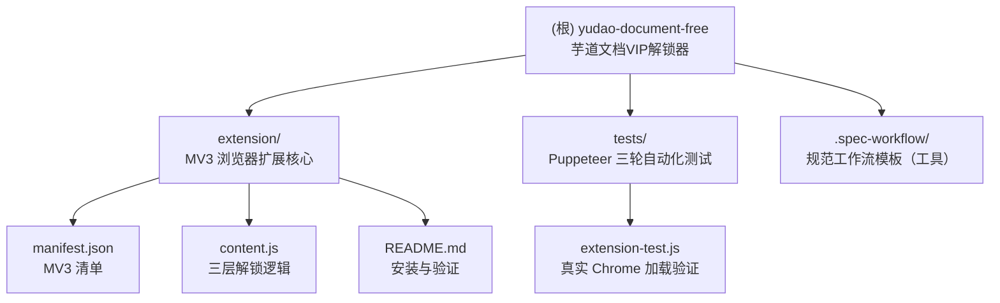

# yudao-document-free · AI 上下文索引

> 本文件由 init-architect 子智能体于 2026-06-27 10:13:41 自动生成，用于为 AI 助手提供项目全局上下文。模块细节请阅读各子目录下的 `CLAUDE.md`。

---

## 一、项目愿景与简介

**芋道文档 VIP 解锁器** —— 一个 Chrome / Edge 浏览器扩展（Manifest V3），用于解锁 `doc.iocoder.cn` 上的付费（VIP）文档，让用户在不购买 VIP 的情况下阅读被遮挡的技术文档（如 VO 对象转换、BPM、API 文档等）。

### 核心思路（三层防护）

目标站点 `app.js` 通过名为 `88974ed8-6aff-48ab-a7d1-4af5ffea88bb` 的 cookie 判断是否 VIP，并异步调用 `$.get("/zsxq/auth")` 做服务端校验；假 cookie 必然校验失败 → 清 cookie + `location.reload()`，在 SPA 路由切换下导致后续点击直接拦截。扩展以 content script（`document_start` + `MAIN` world）三层破解：

1. **注入 VIP cookie** → 让站点判 VIP 函数 `d()` 返回 `true`；
2. **劫持原生 `XMLHttpRequest`** → 拦截 `/zsxq/auth` 校验请求，伪造 `status=200, response="true"`，使校验恒通过，阻止清 cookie 与 reload；
3. **覆盖 `Cookies.remove`** → 兜底禁止清除 VIP cookie；并监听 `popstate` / 劫持 `history.pushState|replaceState` 在 SPA 路由切换后补注入 cookie。

### 演进历史

- v1.x：油猴脚本方案（`userscripts/`，**已废弃并从工作区删除**，见 git status `D`）
- v2.0.0：cookie 注入解锁方案
- v2.1.0：拦截 auth 校验解决 SPA 路由切换拦截
- v2.2.0：拦截 `XMLHttpRequest` 原生层彻底解决 SPA 拦截（当前版本）
- 当前主分支：`feat: 新增浏览器扩展方案(MV3),替代油猴脚本`（commit `4d24773`）

---

## 二、技术栈总览

| 维度 | 选型 |
| --- | --- |
| 扩展规范 | Chrome / Edge Manifest V3 |
| 运行时 | content script，`run_at: document_start`，`world: MAIN`（需 Chrome/Edge 111+） |
| 实现语言 | 原生 JavaScript（无框架、无打包、无 TypeScript） |
| 目标站点技术 | Vue + jQuery 3.6 + js.cookie + vue-router（SPA） |
| 自动化测试 | Puppeteer-core（Node.js CommonJS），真实 Chrome 三轮点击验证 |
| 包管理 | 根 `package.json`（`"type": "commonjs"`），但**已被 `.gitignore` 忽略**，仅用于本地测试依赖 |
| 权限 | 无 `permissions`，仅 `host_permissions: *://doc.iocoder.cn/*, *://static.iocoder.cn/*` |

---

## 三、架构总览



### 运行时数据流

```
[浏览器加载扩展] 
   → content.js 在 document_start + MAIN world 注入
      → 劫持 XMLHttpRequest.prototype.open/send   (第二层，最先执行)
      → document.cookie 注入 VIP cookie            (第一层)
      → 轮询覆盖 window.Cookies.remove             (第三层，等 js.cookie 加载)
      → 劫持 history.pushState/replaceState + popstate 监听 (SPA 路由补注入)

[用户访问/切换 doc.iocoder.cn VIP 页面]
   → 站点 app.js afterEach 读 cookie → d()=true
   → 站点发 $.get("/zsxq/auth") → 命中劫持 → 伪造 response="true"
   → 校验通过，不清 cookie、不 reload → 文档正常展示
```

---

## 四、模块索引

| 模块路径 | 职责一句话 | 语言 | 入口文件 | 本地文档 |
| --- | --- | --- | --- | --- |
| `extension/` | MV3 浏览器扩展核心：注入 VIP cookie + 劫持 XHR auth 校验 + 防 cookie 清除 | 原生 JS | `extension/content.js` | [extension/CLAUDE.md](./extension/CLAUDE.md) |
| `tests/` | Puppeteer-core 真实 Chrome 加载扩展代码，三轮（顺序点击/快速连点/反向验证）自动化测试 | Node.js (CJS) | `tests/extension-test.js` | [tests/CLAUDE.md](./tests/CLAUDE.md) |
| `.spec-workflow/` | spec-workflow 工具的模板目录（需求/设计/任务/产品/技术/结构模板），非项目业务代码 | Markdown | — | （工具模板，未单独生成模块文档） |

---

## 五、全局开发规范

1. **不修改目标站点源码**：所有解锁逻辑在客户端 content script 内完成，不依赖服务端改动。
2. **无打包、无转译**：`content.js` 必须保持纯原生 JS，可直接被浏览器加载；禁止引入需要构建步骤的语法（ES Module import、TS、JSX 等）。
3. **运行环境约束**：依赖 `world: MAIN`（页面主上下文）以拦截页面自身的 XHR，需 Chrome/Edge 111+。
4. **cookie 名耦合**：`VIP_COOKIE_NAME = '88974ed8-6aff-48ab-a7d1-4af5ffea88bb'` 硬编码，站点改名需同步更新 `content.js` 常量。
5. **日志前缀统一**：所有控制台输出使用 `[iocoder-unlocker]` 前缀，便于 F12 排查。
6. **注释语言**：中文（与现有代码库一致）。
7. **测试纪律**：改动 `content.js` 后，应运行 `tests/extension-test.js` 验证三轮全部通过再提交。
8. **Git 忽略**：`node_modules/`、`package.json`、`package-lock.json`、`.playwright-mcp/`、`.tmp-*`、`tests/screenshots/` 均被忽略——`package.json` 不作为正式交付物，仅为本地测试依赖载体。

---

## 六、关键命令

### 加载扩展（开发者）

- **Chrome**：访问 `chrome://extensions/` → 开启「开发者模式」→「加载已解压的扩展程序」→ 选择 `extension/` 文件夹 → 访问 `https://doc.iocoder.cn/vo/` 验证。
- **Edge**：访问 `edge://extensions/` → 开启「开发人员模式」→「加载解压缩的扩展」→ 选择 `extension/` 文件夹。

### 运行自动化测试

```bash
# 1. 安装测试依赖（puppeteer-core 不自带 Chrome，需本机已装 Chrome）
npm install puppeteer-core

# 2. 运行真实浏览器三轮测试（脚本内硬编码 Chrome 路径，见下）
node tests/extension-test.js
```

> 注意：`tests/extension-test.js` 第 8 行硬编码 `CHROME = 'C:/Program Files/Google/Chrome/Application/chrome.exe'`，非 Windows 或非默认路径需手动修改。测试以 `process.exit(pass ? 0 : 1)` 返回退出码，可用于 CI。

### 验证扩展是否生效

F12 控制台应依次输出：
```
[iocoder-unlocker] 芋道文档VIP解锁器启动
[iocoder-unlocker] XMLHttpRequest 劫持完成
[iocoder-unlocker] VIP cookie 已注入
[iocoder-unlocker] 脚本初始化完成
[iocoder-unlocker] Cookies.remove 保护完成
[iocoder-unlocker] 已拦截 auth 校验请求: ...
```

---

## 七、覆盖率与缺口说明

### 本次扫描覆盖率

| 指标 | 数值 |
| --- | --- |
| 估算源文件总数（排除 `node_modules`、`.git`） | 13 |
| 已读取/分析文件数 | 13 |
| 覆盖百分比 | 100% |
| 是否因上限截断 | 否（`truncated: false`） |

### 主要缺口

1. **依赖声明缺失**：根 `package.json` 未声明 `puppeteer-core` 依赖（且该文件被 `.gitignore` 忽略），新克隆者需手动 `npm install puppeteer-core` 才能跑测试。
2. **无 CI/CD 配置**：未发现 `.github/workflows/`、`.gitlab-ci.yml` 等，三轮测试只能本地手动运行。
3. **无 lint / format 工具**：未配置 ESLint / Prettier，代码风格靠人工维护。
4. **Chrome 路径硬编码**：`tests/extension-test.js` 中 Chrome 可执行路径写死为 Windows 默认路径，跨平台兼容性差。
5. **历史方案归档缺失**：`userscripts/`、`docs/superpowers/` 及早期测试文件（`popup-remover-test.html`、`real-site-test.js`、`run-test.js`）已从工作区删除（git status 标记 `D`，尚未提交删除），如需追溯历史需查 git log。
6. **`.spec-workflow/` 未深度扫描**：该目录为 spec-workflow 工具的标准模板，非项目业务代码，仅在索引中登记，未生成模块级 `CLAUDE.md`。

---

## 八、AI 使用指引

- **修改解锁逻辑**：优先阅读 [`extension/CLAUDE.md`](./extension/CLAUDE.md)，核心常量与三层防护入口集中在 `extension/content.js` 顶部。
- **修改/新增测试**：阅读 [`tests/CLAUDE.md`](./tests/CLAUDE.md)，注意测试通过 `evaluateOnNewDocument` 注入 `content.js` 真实代码（等价于 manifest 的 `document_start` + `MAIN`），而非 `--load-extension`。
- **站点改 cookie 名**：仅需修改 `content.js` 的 `VIP_COOKIE_NAME` 常量，并同步更新 `tests/extension-test.js` 中 `cookieOk: document.cookie.includes('88974ed8')` 的判断串。
- **不要**在 `extension/` 内引入任何需要构建的工具链；保持零依赖原生 JS。

---

## 九、变更记录 (Changelog)

| 时间 | 操作 | 说明 |
| --- | --- | --- |
| 2026-06-27 10:13:41 | 初始化 | init-architect 子智能体首次生成根级与模块级 `CLAUDE.md`、`.claude/index.json`；生成 Mermaid 结构图；为 2 个业务模块添加导航面包屑。覆盖率 100%。 |
